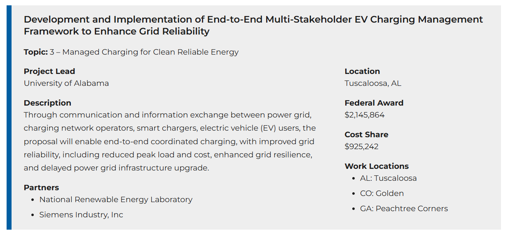

---

**Jan 2025** - Awarded project from **DOE Joint Office of Energy and Transportation**
-----
Funding amount: $3 Million (30% cost share)

The details of the program can be found in the link: [The Joint Office of Energy and Transportation: Communities Taking Charge Accelerator](https://driveelectric.gov/communities-taking-charge)

**Sep 2023** - Awarded project from **Argonne National Laboratory**
-----
Funding amount: $75,000