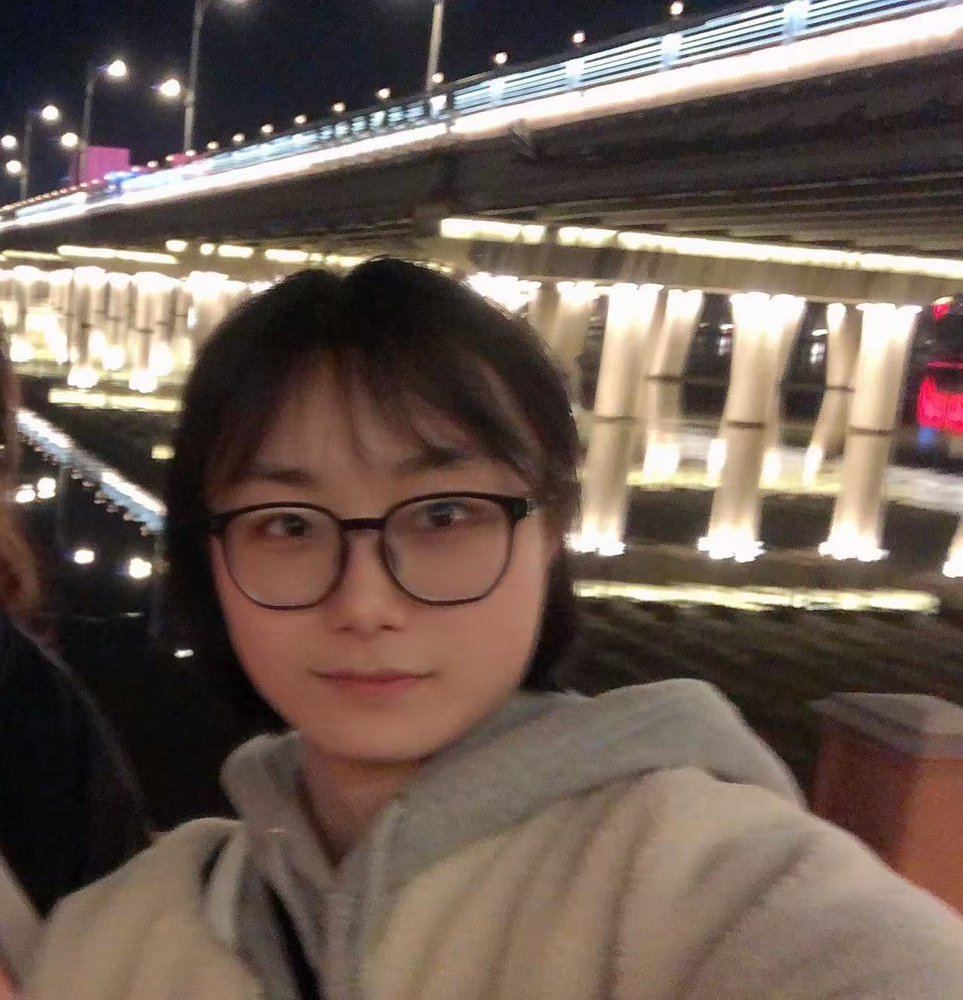



Post-doctoral Researchers 
-----

  
  

    <h4 style="font-size:1.28rem; line-height:1.25;">Yuwei Jin</h4>
    
Post-doctoral Researcher · Incoming (Oct 2025)

    
<strong>Education:</strong> B.E., Electrical Engineering, <em>Beihua University, Jilin, China/2010-2014</em>; M.S., Electrical Engineering, <em>Northeast Electric Power University, Jilin, China/2014-2017</em>; Ph.D., Electronic and Electrical Engineering, <em>Kyungpook National University, Daegu, South Korea/2018-2023</em>.

    
<strong>Research interests:</strong> Renewable energy systems, Energy management system, smart grid reliability and resilience.

    <!-- Optional links -->
    <!-- 
<a href="mailto:ravi@ua.edu">Email</a> · <a href="https://scholar.google.com/...">Scholar</a> · <a href="https://www.linkedin.com/in/...">LinkedIn</a>
 -->
  

PhD Students
-----

  
  

    <h4 style="font-size:1.28rem; line-height:1.25;">Ravi Shrestha</h4>
    
PhD Student · Jan 2024 – present

    
<strong>Education:</strong> B.E., Electrical Engineering, <em>Kathmandu University, Dhulikhel, Nepal/2010-2014</em>; M.S., Electrical Engineering, <em>Kathmandu University, Dhulikhel, Nepal/2015-2017</em>.

    
<strong>Research interests:</strong> EV infrastructure planning, distribution system modeling and optimization, probabilistic power flow.

    <!-- Optional links -->
    <!-- 
<a href="mailto:ravi@ua.edu">Email</a> · <a href="https://scholar.google.com/...">Scholar</a> · <a href="https://www.linkedin.com/in/...">LinkedIn</a>
 -->
  

  
  

    <h4 style="font-size:1.28rem; line-height:1.25;">Baitong Zhai</h4>
    
PhD Student · Aug 2025 – present

    
<strong>Education:</strong> B.S., <em>Electrical Engineering and Automation</em>, <em>Northeast Electric Power University, Jilin, China/2018-2022</em>; M.S., <em>Electrical Engineering</em>, <em>Northeastern University, Shenyang, Chin/2022-2025</em>.

    
<strong>Research interests:</strong> Power distribution system optimization, EV charging management.

    <!-- 
<a href="mailto:...">Email</a> · <a href="...">Scholar</a> · <a href="...">LinkedIn</a>
 -->
  

Undergraduate Students
-----

  
  

    <h4 style="font-size:1.28rem; line-height:1.25;">Cameron Matyjasik</h4>
    
Undergraduate Student · Aug 2024 – present

    
<strong>Education:</strong> B.S., <em>Electrical Engineering</em>, <em>the University of Alabama, AL, USA/2020-present</em>.

    
<strong>Research interests:</strong> Power distribution system simulation.

    <!-- 
<a href="mailto:...">Email</a> · <a href="...">Scholar</a> · <a href="...">LinkedIn</a>
 -->
  

Join the Team
-----
[Download PhD Position Description here](https://lushawangece.github.io//files/ad.pdf)
  